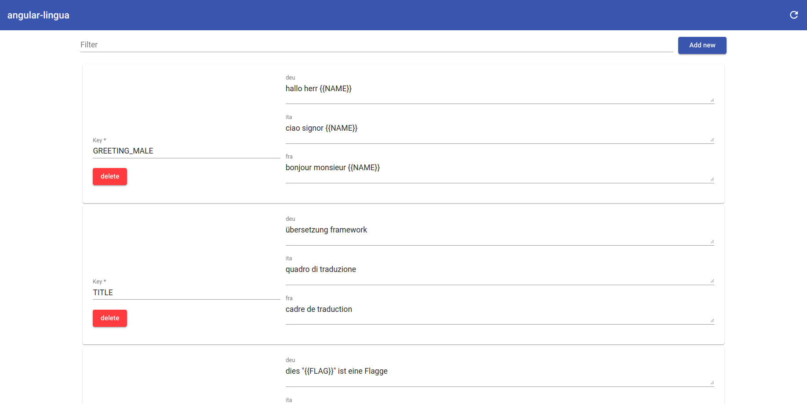
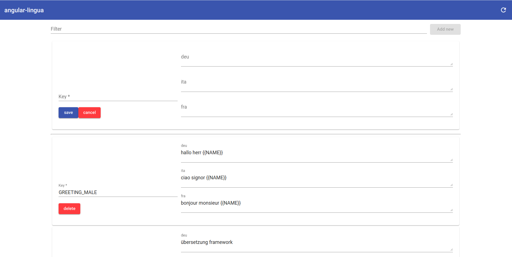

# AngularLingua

AngularLingua is an easy to use Translation Library with Typescript autocompletion and Compile-time safety that your Translation exists.

## Important
If you want the Compile-time safety to work you have to build it with aot enabled.

## install / integrate

First you need to install the npm module:
```bash
npm i angular-lingua
```
To use angular-lingua in your project you have to import the module in your AppModule and provide a default language. This language can be changed at runtime.

```typescript
import { NgModule } from '@angular/core';
import { TranslationModule, LANGUAGE_TOKEN } from 'angular-lingua';
import { AppComponent } from './app.component';

@NgModule({
  declarations: [
    AppComponent
  ],
  imports: [
    TranslationModule.forRoot(),
    ...
  ],
  providers: [
    {
      provide: LANGUAGE_TOKEN,
      useValue: 'ita'
    }
  ],
  bootstrap: [AppComponent]
})
export class AppModule { }
```

## Translation file

All your translations are in a single Typescript file.
this file could be located at: src/locales/locales.ts. important ist that it expots all the translations under 'LOCALES'.

Your translation file is composed of translations keys, whom hold key value of the lanuagekey and the actual translation.
In your translations you can have variables with two curly braces. Those you can replace at runtime.

```typescript
export const LOCALES =  {
  'TITLE': {
    'deu': 'übersetzung framework',
    'ita': 'quadro di traduzione',
    'fra': 'cadre de traduction'
  },
  'GREETING_MALE': {
    'deu': 'hallo herr {{NAME}}',
    'ita': 'ciao signor {{NAME}}',
    'fra': 'bonjour monsieur {{NAME}}'
  },
  'FLAG': {
    'deu': 'dies \"{{FLAG}}\" ist eine Flagge',
    'ita': 'questa \"{{FLAG}}\" è una bandiera',
    'fra': 'c\"est \"{{FLAG}}\" un drapeau'
  }
};
```

## Usage inside template

To use the translations in the template of a component you have to copy it into a member variable. Thus is then accesable in the template.

```typescript
import {Component} from '@angular/core';
import {LOCALES} from '../locales/locales';

@Component({
  selector: 'app-root',
  templateUrl: './app.component.html',
  styleUrls: ['./app.component.scss']
})
export class AppComponent {
  readonly LOCALES = LOCALES;
}
```

You have three options to translate in your template. With all of these options you can pass variables into the translation or fix the language.

### Directive

```html
<p [i18n]="LOCALES.TITLE"></p>

<!-- Example with Parameters -->
<p [i18n]="LOCALES.GREETING_MALE" [i18nParams]="{NAME: 'Hans Peter'}"></p>

<!-- Example with fixed language -->
<p [i18n]="LOCALES.TITLE" i18nLanguage="ita"></p>
```

### Pipe

```html
<p>
  {{ LOCALES.TITLE | i18n }}
</p>

<!-- Example with Parameters -->
<p>
  {{ LOCALES.GREETING_MALE | i18n: {NAME: "Hans Peter"} }}
</p>

<!-- Example with fixed language -->
<p>
  {{ LOCALES.TITLE | i18n: {} : 'ita' }}
</p>
```

### Component

Special about the component is that you can replace your Variable placeholders with whole Components.

```html
<translate [key]="LOCALES.TITLE">
</translate>

<!-- Example with Parameters -->
<translate [key]="LOCALES.FLAG">
  <mat-icon *appOptKey="'FLAG'">flag</mat-icon>
</translate>

<!-- Example with fixed language -->
<translate [key]="LOCALES.FLAG">
  <ng-template appOptKey="FLAG">
    <mat-icon>flag</mat-icon>
  </ng-template>
</translate>
```

## Usage with service

you can inject the service like any other.
```typescript
constructor(private translationService: TranslationService) {}
```

```typescript
  basicExample() {
    const result = this.translationService.get(LOCALES.TITLE);
    console.log(result);
  }

  exampleWithParameters() {
    const result = this.translationService.get(LOCALES.GREETING_MALE, {NAME: 'Hans Peter'});
    console.log(result);
  }

  examplesWithFixedLanguage() {
    const result = this.translationService.get(LOCALES.TITLE, {}, 'ita');
    console.log(result);
  }
```
## Switching language at runtime

When you change the language at runtime all the translations will be updated.

```typescript
this.translationService.changeLanguage("fra");
```

## GUI

With this web UI you have a simple way to search update add and delete your translations.

It can be installed over npm.

```bash
npm i --save-dev angular-lingua-gui
```

then you can create a run script in your package.json. the first parameter is where your location file is stored. After that, you can specify the language keys.

```json
{
  "scripts": {
    "angular-lingua-gui": "angular-lingua-gui src/locales/locales.ts deu ita fra"
  }
}
```



